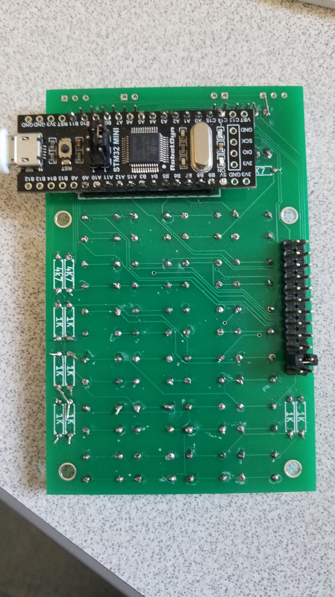
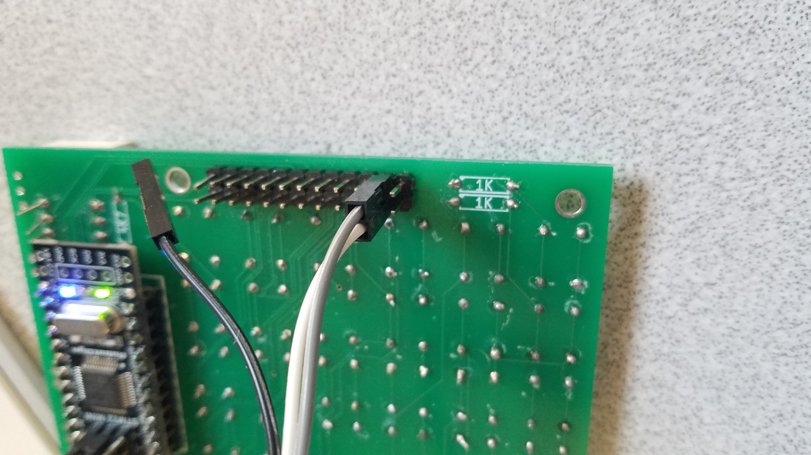
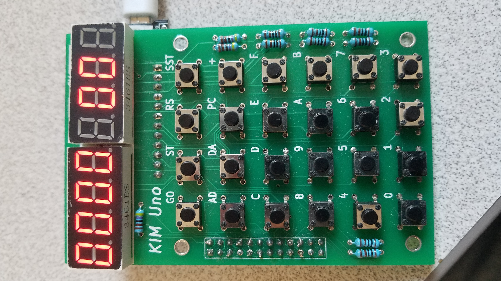

# KIM1-Blackpill
## A mod to use an ARM Black Pill on the KIM-UNO board

My wife gave me a KIM-UNO board for Christmas a few years ago and
I wanted to put an ARM board on it instead of an Arduino so it could
do more of a full emulation. When I first started this, I got a RobotDyn
Black Pill with an STMF303 processor on it. Since then, the Black Pill
design has been revised and there is a reset pin in a place that
makes it harder to do this and still have easy access to the I/O pins.
Maybe someone with better PCB design skills could make a version of 
the KIM-UNO board that was more friendly towards a Black Pill so it
could take one of the newer boards with a faster processor and more RAM.

Here is a picture of the Black Pill installed on the board. The A9
and A10 pins on the Black Pill line up with the TX/RX pins on the
socket. It doesn't matter that some of the pins are for the Arduino
Pro Mini power, except that you have to power this via USB.


Since the RX/TX pins line up, you can upload code to the board 
via the RX/TX pins on the expansion slot. The gray wire is connected
to the RXD pin on my FT232 adapter, and white to TXD. When not hooked
to the board, I keep a jumper across those pins to keep noise from
causing the KIM-1 to drop into serial mode.


## Code
I originally created the project with the STM32 Cube IDE, but then
switched over to JetBrains' CLion, which made a CMake project for me.
I modified Mike Chambers' fake6502 a little bit, changing the lookup
table structure, which increases the code size, but reduces the lookups.
I also modified it to optionally use ARM registers r5-r10 to hold the
6502 registers, which reduces code size and cuts down on memory
accesses. To get that to work, I added the -ffixed-r5 ... -ffixed-r10
to the compiler options to tell GCC not to use those registers.
For comparison, here is the clc function without the global registers:
```
 800021c:	4a02      	ldr	r2, [pc, #8]	; (8000228 <clc+0xc>)
 800021e:	7813      	ldrb	r3, [r2, #0]
 8000220:	f023 0301 	bic.w	r3, r3, #1
 8000224:	7013      	strb	r3, [r2, #0]
 8000226:	4770      	bx	lr
 8000228:	2000009d 	.word	0x2000009d
```
Here is the same function with the global registers:
```
 80003d4:	f00a 0afe 	and.w	sl, sl, #254	; 0xfe
 80003d8:	4770      	bx	lr
 80003da:	bf00      	nop
```

I mostly let the KIM-1 ROM code do the work, that's the main reason
I wanted to use the ARM board instead of the Arduino Pro Mini. The
LED control and keyboard scanning is done by the ROM, with this code
emulating the 6530 PIA chips. There are a couple of exceptions, however.
First, I find it very difficult to emulate the KIM-1 serial ports
because it is so dependent on timing. Instead, I just check to see
if the program is executing the ROM routines to read or write to the
serial port and execute ARM code to do that.

Second, I hacked the
paper tape loading so it echoes data back. I was hoping to be able
to send files from cu, but instead just made a Go program that works
with it and uploads files pretty quickly. The code is in the papertape
directory here.

Third, the KIM-1 had the ST, RS, and SST buttons/switch wired directly
to the 6502 (there's a little extra circuitry for the NMI). I added
a periodic scan for those keys so they will work even when the
system isn't scanning for keys.

## Building
I normally just build this from CLion, but this command-line should work
from main directory:
```
cmake --build cmake-build-release --target all -- -j 25
```

## Flashing
I use the stm32flash utility to flash the board. I am running Linux
Mint and was able to install stm32flash with `sudo apt install
stm32flash`. I hook up the serial cable, move the BOOT0 jumper over
on the board so it is on the "1" side, hit the reset button, and then
from the `cmake-build-release` directory type:
```
stm32flash /dev/ttyUSB0 -w kim1-blackpill.bin -v
```
When it is done, I move the BOOT0 jumper back to "0" and hit reset
again and the KIM-UNO looks like this:

